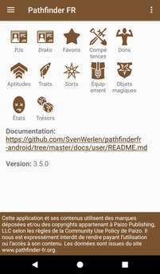
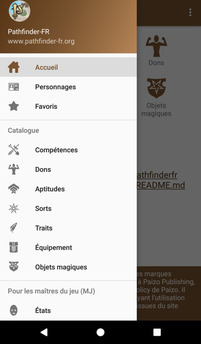

# Documentation utilisateur

Cette section documente l'application PathfinderFR-Android. 
Sections les plus fréquemment consultées:
* [Navigation](./navigation/README.md)
* [Gestion des personnages](./character/character-details.md)
* [Tutoriels](./tuto/README.md)

## Écran d'accueil

Les écrans d'accueil au premier démarrage et en utilisation.

 ## Navigation

La [navigation latérale](./navigation/README.md) au premier démarrage et en utilisation.

