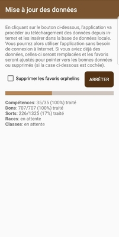
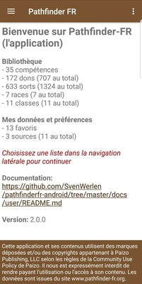
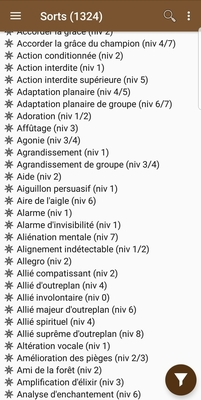
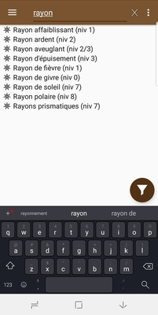
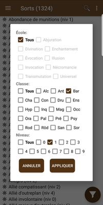

# User documentation

This page describes how to use the application. Since the application is targeting the french community,
the documentation is only available in french.

## Références rapides

* Ci-dessous: gestion des données, catalogue (compétences, dons, aptitudes, sorts, traits, ...) et options
* [Personnages](characters.md): création et gestion d'une feuille de personnage

## Pré-requis: importer les données

La première étape consiste à importer les données dans l'application. Les données seront téléchargées
de [pathfinderfr-data](https://github.com/SvenWerlen/pathfinderfr-data/tree/master/data), elles-mêmes
extraites du site web [pathfinder-fr.org](http://www.pathfinder-fr.org).

* Ouvrir le panneau de navigation latéral
* Choisir _Mettre à jour la bibliothèque_
* Cliquer sur le bouton _Démarrer_
* Attendre la fin du processus 

_Note: l'application va télécharger environ 3 Mb de données_ 

_La première mise à jour télécharge l'intégralité des données. Par la suite, vérifiez régulièrement
 si de nouvelles mises à jour des données existent. L'application téléchargera uniquement les listes
 pour lesquelles des mises à jour existent. Si vous voulez tout re-télécharger, cocher la case
 "Forcer la mise à jour"._

## Visionner les listes

Lorsque l'application dispose de données, la page d'accueil présentera les statistiques et la
navigation latérale permettra d'accéder aux différentes rubriques (compétences, dons, sorts). 

* Cliquer sur une rubrique pour obtenir la liste des éléments correspondants
* Cliquer sur un élément pour obtenir sa description
  * Les détails (métadonnées) sont affichés par défaut mais il est possible de les désactiver dans les préférence de l'application.
  * Le bouton _lien_ (barre d'action) ouvre un navigateur vers la fiche [pathfinder-fr.org](https://www.pathfinder-fr.org) correspondante et permet d'ainsi accéder à toute l'information.
  * Le bouton _étoile_ (barre d'action) permet d'ajouter ou retirer l'élément de vos favoris
  

 
 
 ## Filtrer / rechercher les listes
 
 L'application permet de filtrer les listes grâce à sa fonction de recherche intégrée dans la 
 barre supérieure de l'application.
 
 * La recherche est uniquement disponible dans la vue _liste_
 * Le filtre prend effet uniquement lorsqu'au moins 3 charactères sont saisis
 * Cliquer sur le bouton _x_ (croix) pour fermer la recherche et réinitialiser la liste complète
 * Changer de liste ré-initialisera la recherche
 
 L'application permet également de filtrer les listes grâce à sa fonction de filtre (bouton dans le coin inférieur droit)
 
 * Le bouton de filtre est uniquement disponible dans la vue _liste_ et pour les _sorts_
 * Décocher l'option _Tous_ et cocher les catégories souhaitées individuellement
 * Cliquer sur le bouton _Appliquer_ pour appliquer les filtres
 * Noter que le bouton change de couleur pour indiquer que des filtres sont actifs. 
 
 Les options de filtre sont conservées dans les préférences de l'application. Vous pouvez changer
 d'écran ou redémarrer l'application, les filtres continueront de s'appliquer.  
 
 
 
 
  ## Paramètres et configuration
  
  L'application offre des configurations et paramètres selon les besoins de l'utilisateur.
  
  * **Général | Afficher l'avertissement**: permet de désactiver l'avertissement (_disclaimer/copyright_) au bas de la page d'accueil.
  * **Général | Nom long dans les listes**: affiche un nom long dans les listes. Exemple: affiche le niveau du sort directement dans la liste. 
  * **Général | Détail des compétences, dons, sorts**: affiche le mode détaillé par défaut (voir ci-dessus). Recommandé!
  * **Sources de données**: permet d'activer/désactiver les sources de données avec lesquelles vous jouez. Par exemple, désactiver "Art de la magie" permet de masquer tous les sorts qui proviennent de cette extension.
