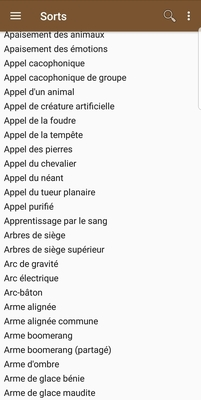
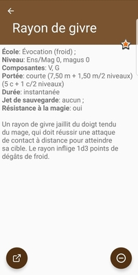
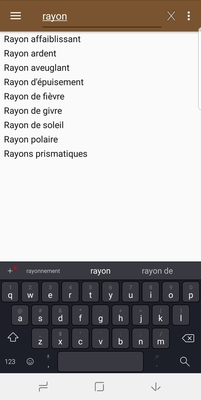

# User documentation

This page describes how to use the application. Since the application is targeting the french community,
the documentation is only available in french.

## Pré-requis: importer les données

La première étape consiste à importer les données dans l'application. Les données seront téléchargées
de [pathfinderfr-data](https://github.com/SvenWerlen/pathfinderfr-data/tree/master/data), elles-mêmes
extraites du site web [pathfinder-fr.org](http://www.pathfinder-fr.org).

* Ouvrir le panneau de navigation latéral
* Choisir _Mettre à jour la bibliothèque_
* Cliquer sur le bouton _Démarrer_
* Attendre la fin du processus 

_Note: l'application va télécharger environ 3 Mb de données_ 

## Visionner les listes

Lorsque l'application dispose de données, la page d'accueil présentera les statistiques et la
navigation latérale permettra d'accéder aux différentes rubriques (compétences, dons, sorts). 

* Cliquer sur une rubrique pour obtenir la liste des éléments correspondants
* Cliquer sur un élément pour obtenir sa description
  * Le bouton _plus/moins_ (en bas à droite) permet d'afficher les détails (attributs/métadonnées)
  * Le bouton _étoile_ (en haut à droite) permet de mettre l'élément dans la liste des favoris
  * Le bouton _lien_ (en bas à gauche), visible uniquement en mode "détails" ouvre un navigateur vers la fiche [pathfinder-fr.org](https://www.pathfinder-fr.org) correspondante.

 
 
 ## Filtrer / rechercher les listes
 
 L'application permet de filtrer les listes grâce à sa fonction de recherche intégrée dans la 
 barre supérieure de l'application.
 
 * La recherche est uniquement disponible dans la vue _liste_
 * Le filtre prend effet uniquement lorsqu'au moins 3 charactères sont saisis
 * Cliquer sur le bouton _x_ (croix) pour fermer la recherche et réinitialiser la liste complète
 * Changer de liste ré-initialisera la recherche
 
 
 
 
  ## Paramètres et configuration
  
  L'application offre des configurations et paramètres selon les besoins de l'utilisateur.
  
  * **Général | Voir les détails**: affiche le mode détaillé par défaut (voir ci-dessus). Évite de devoir cliquer systématiquement sur le bouton _plus_ pour voir les métadonnées. 