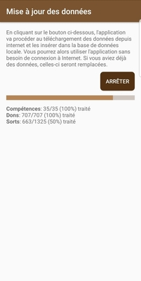
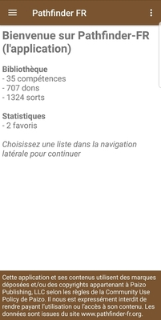

# User documentation

This page describes how to use the application. Since the application is targeting the french community,
the documentation is only available in French.

## Pré-requis: importer les données

La première étape consiste à importer les données dans l'application. Les données seront téléchargées
de [pathfinderfr-data](https://github.com/SvenWerlen/pathfinderfr-data/tree/master/data), elles-mêmes
extraites du site web [pathfinder-fr.org](http://www.pathfinder-fr.org).

* Ouvrir le panneau de navigation latéral
* Choisir _Mettre à jour la bibliothèque_
* Cliquer sur le bouton _Démarrer_
* Attendre la fin du processus 

_Note: l'application va télécharger environ 3 Mb de données_ 

## Visionner les listes

Lorsque l'application dispose de données, la page d'accueil présentera les statistiques et la
navigation latérale permettra d'accéder aux différentes rubriques:

 |
 