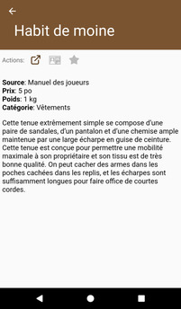

# [Accueil](../README.md) > [Catalogue](../navigation/README.md) > [Équipement](equipment.md) > Détails

Cette page présente les détails d'un équipement.

## Actions

* 
**Référence**: permet d'accéder à la page de référence (www.pathfinder-fr.org) 
pour cet équipement.
* 
**Ajout au personnage** _(apparaît uniquement si un personnage est épinglé)_: 
Cliquer pour ajouter cet élément à l'équipement du personnage. Noter que l'icône n'indique jamais si le 
personnage possède déjà cet équipement car il est possible d'ajouter plusieurs du même type.
*  
**Favoris**: permet d'ajouter / retirer un équipement de la [liste de vos favoris](favorites.md). 

## Description

La qualité de la description dépend de la complexité de la page et des données extraites du site
www.pathfinder-fr.org. Les titres sont présentés en majuscules et les tableaux sous la forme d'une
liste de points. Utiliser l'action  pour visionner la page
source au format complet.