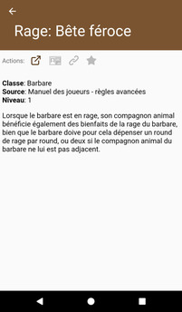
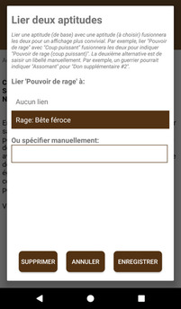
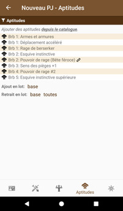
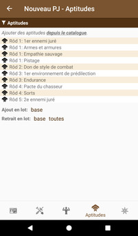
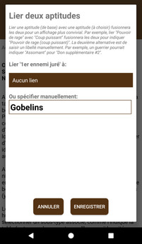
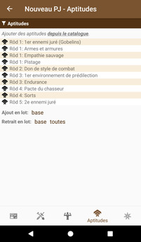

# [Accueil](..) > [Catalogue](../navigation) > [Aptitudes](features.md) > Détails

Cette page présente les détails d'une aptitude.

## Actions

* 
**Référence**: permet d'accéder à la page de référence (www.pathfinder-fr.org) 
pour cette aptitude.
*  
**Ajout/retrait au personnage** _(apparaît uniquement si un personnage est épinglé)_: indique si le 
personnage possède cette aptitude. Cliquer pour ajouter ou retirer l'aptitude au personnage épinglé. 
*  
**Lier l'aptitude** _(apparaît uniquement si un personnage est épinglé)_: permet de lier une aptitude
à une autre OU de lui attribuer un texte spécifique. Voir ci-dessous. 
*  
**Favoris**: permet d'ajouter / retirer une compétence de la [liste de vos favoris](favorites.md). 

### Lier une aptitude à une autre

En cliquant sur l'action , il est possible de lier une aptitude
spécifique (à choisir) avec une aptitude obtenue automatiquement en fonction de la classe de votre
personnage. L'exemple ci-dessous présente comment lier le pouvoir de rage spécifique _Bête féroce_ 
à l'aptitude _Pouvoir de rage_ obtenue par un barbare de niveau 2. 

### Spécifier un texte pour une aptitude

En cliquant sur l'action , il est également possible d'attribuer
un texte spécifique à une aptitude. L'exemple ci-dessous présente comment spécifier l'ennemi juré
pour l'aptitude d'un rôdeur de niveau 1. 

## Description

La qualité de la description dépend de la complexité de la page et des données extraites du site
www.pathfinder-fr.org. Les titres sont présentés en majuscules et les tableaux sous la forme d'une
liste de points. Utiliser l'action  pour visionner la page
source au format complet.

