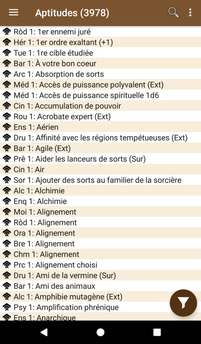
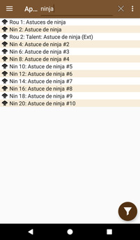
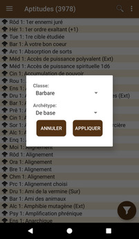
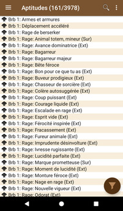

# [Accueil](..) > [Catalogue](../navigation) > Aptitudes

La liste des aptitudes de Pathfinder.

Cliquer sur un élément de la liste permet d'accéder à la [page de détail de l'aptitude](feature-details.md).

## Recherche

En cliquant sur la loupe, il est possible d'effectuer une recherche dans la liste 

## Filtres

En cliquant sur le bouton "filtre" (en bas à droite), il est possible de filtrer la liste en 
sélectionnant la classe et l'archétype désiré. Les filtres peuvent être combinées avec
la recherche.

