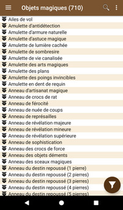
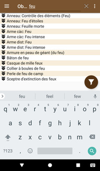
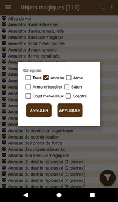
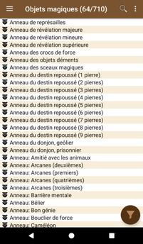

# [Accueil](../README.md) > [Catalogue](../navigation/README.md) > Objets magiques

La liste des objets magiques de Pathfinder.

Cliquer sur un élément de la liste permet d'accéder à la [page de détail d'un objet magique](magic-details.md).

## Recherche

En cliquant sur la loupe, il est possible d'effectuer une recherche dans la liste 

## Filtres

En cliquant sur le bouton "filtre" (en bas à droite), il est possible de filtrer la liste en 
sélectionnant la/les catégorie(s) souhaitée(s). Les filtres peuvent être combinées avec
la recherche.

