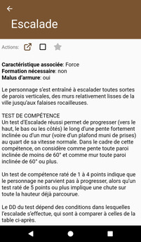

# [Accueil](../README.md) > [Catalogue](../navigation/README.md) > [Compétences](skills.md) > Détails

Cette page présente les détails d'une compétence.

## Actions

* 
**Référence**: permet d'accéder à la page de référence (www.pathfinder-fr.org) 
pour cette compétence.
*  
**Compétence de classe** _(apparaît uniquement si un personnage est épinglé)_: indique s'il s'agit 
d'une compétence de classe. Si la case est décochée, il est possible de la cocher afin d'ajouter la 
compétence en tant que "de classe" pour le personnage (par exemple, suite à l'acquisition d'un don). 
*  
**Favoris**: permet d'ajouter / retirer une compétence de la [liste de vos favoris](favorites.md). 

## Description

La qualité de la description dépend de la complexité de la page et des données extraites du site
www.pathfinder-fr.org. Les titres sont présentés en majuscules et les tableaux sous la forme d'une
liste de points. Utiliser l'action  pour visionner la page
source au format complet.