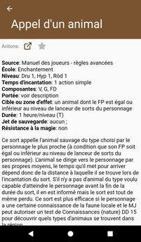

# [Accueil](../README.md) > [Catalogue](../navigation/README.md) > [Sorts](spells.md) > Détails

Cette page présente les détails d'un un sort.

## Actions

* 
**Référence**: permet d'accéder à la page de référence (www.pathfinder-fr.org) 
pour ce sort.
*  
**Favoris**: permet d'ajouter / retirer un sort de la [liste de vos favoris](favorites.md). 

## Description

La qualité de la description dépend de la complexité de la page et des données extraites du site
www.pathfinder-fr.org. Les titres sont présentés en majuscules et les tableaux sous la forme d'une
liste de points. Utiliser l'action  pour visionner la page
source au format complet.

