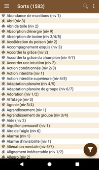
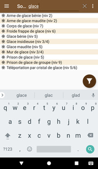
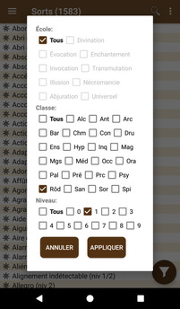
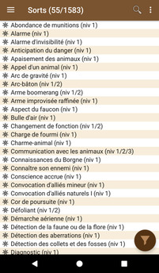

# [Accueil](..) > [Catalogue](../navigation) > Sorts

La liste des sorts de Pathfinder.

Cliquer sur un élément de la liste permet d'accéder à la [page de détail du sort](spell-details.md).

## Recherche

En cliquant sur la loupe, il est possible d'effectuer une recherche dans la liste 

## Filtres

En cliquant sur le bouton "filtre" (en bas à droite), il est possible de filtrer la liste en 
cochant les options désirées (école, classe et niveau). Les filtres peuvent être combinées avec
la recherche.

