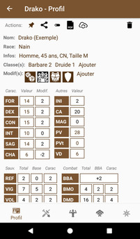
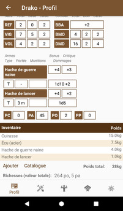
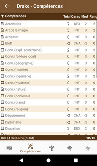
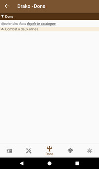
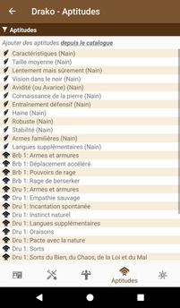
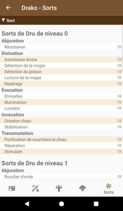

# [Accueil](../README.md) > [Personnages](character.md) > Gérer un personnage

## Les différentes sections

La gestion d'un personnage est divisée en plusieurs sections. 
* La [section "profil"](character-main.md) permet la gestion de la majorité des attributs et de l'équipement du personnage.

* La [section "compétences"](character-skills.md) permet la gestion des compétences du personnage
* La [section "dons"](character-feats.md) permet la gestion des dons du personnage
* La [section "aptitudes"](character-features.md) permet la gestion des traits et aptitudes du personnage
* La [section "sorts"](character-spells.md) permet la gestion des sorts du personnage

