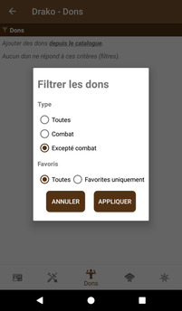
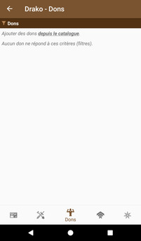

# [Accueil](../README.md) > [Personnages](character.md) > [Gérer](character-details.md) > Dons

La section _Dons_ permet la gestion des dons du personnage.

## Interactions possibles

* Un clic sur la barre d'en-tête du tableau permet d'appliquer des filtres à la liste. Noter que
l'icône de _filtre_ change de couleur lorsque des filtres sont appliqués
* Un clic sur le nom d'un don ouvre le [détail de ce don](../catalog/feat-details.md)
* Un clic sur _depuis le catalog_ ouvre la [liste des dons](../catalog/feats.md) du catalogue et permet ainsi un accès rapide
pour ajouter d'autres dons.

_Voir également: [Tutoriel](../tuto/README.md) > [Créer un nouveau personnage](../character/new-character.md)._ 