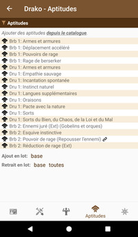

# [Accueil](../README.md) > [Personnages](character.md) > [Gérer](character-details.md) > Aptitudes

La section _Aptitudes_ permet la gestion des traits et aptitudes du personnage.

## Interactions possibles

* Un clic sur la barre d'en-tête du tableau permet d'appliquer des filtres à la liste. Noter que
l'icône de _filtre_ change de couleur lorsque des filtres sont appliqués
* **Ajout en lot "base"**: ajoute toutes les aptitudes auxquelles le personnage a droit en vertu de ses classes et niveau. 
Noter que cette action n'ajoute que des aptitudes pour des niveaux imcomplets (càd qui n'ont pas déjà des aptitudes),
afin de permettre à un joueur de retirer certaines aptitudes et les remplacer par d'autres.
* **Retrait en lot "base"**: retire toutes les aptitudes de base (qui ne doivent pas être ajoutées manuellement).
Noter que cette action brise les liens entre aptitudes.
* **Retrait en lot "toutes"**: retire toutes les aptitudes du personnage. Cette action est souvent utilisée
pendant la création d'un personnage, lorsque l'on change sa classe et que l'on veut réinitialiser 
la liste des aptitudes de base du personnage. 

_Voir également: [Tutoriel](../tuto/README.md) > [Créer un nouveau personnage](../character/new-character.md)._ 