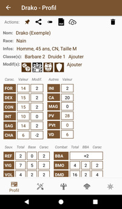
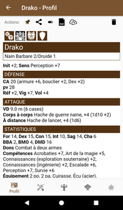
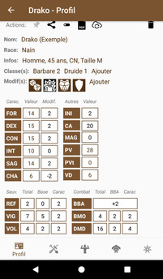
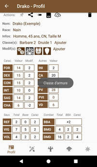
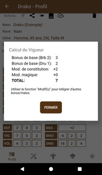
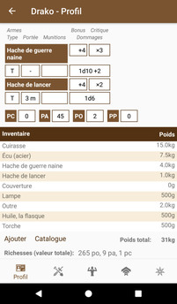
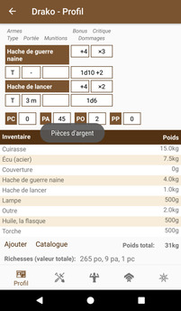
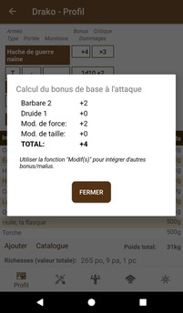
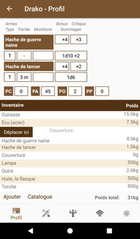

# [Accueil](../README.md) > [Personnages](character.md) > [Gérer](character-details.md) > Profil

La section _Profil_ permet la gestion de la majorité des attributs et de l'équipement du personnage.

## Actions

*  : permet d'épingler
un personnage. Lorsqu'un personnage est épinglé, un raccourci vers sa gestion est présenté sur 
l'[écran d'accueil](..) et des actions supplémentaires deviennent disponibles dans le [catalogue](../navigation/README.md),
notamment la possibilité d'ajouter ou rajouter un élément au personnage épinglé (ex: [Don](../catalog/feat-details.md)).
* : permet d'[exporter un personnage](../tuto/export-import.md) 
au format [YAML](https://fr.wikipedia.org/wiki/YAML)
et éventuellement le partager (ex: courriel). Cette fonction peut servir à faire des archives (backup)
du personnage ou de l'[importer](../tuto/export-import.md)  sur un autre appareil ou encore par une autre personne.
*  : permet de basculer entre le 
mode _Feuille_ qui permet l'édition et le mode _Sommaire_ plus condensé mais en lecture uniquement.
*  (_BETA_): permet la synchronisation d'un personnage et propager
des modifications à d'autres appareils. Cette fonction peut servir à un joueur (PJ) pour soumettre 
les changements après un changement de niveau au maître de jeu (MJ) ou à l'inverse à un MJ de 
distribuer de l'or ou de l'expérience aux personnages.
* : supprime un personnage. Par mesure de précaution, il est 
nécessaire de saisir le nom du personnage ou simplement _"oui"_ pour confirmer la suppression.

## Gestion du profil

La partie supérieure de la section _Profil_ permet la gestion des informations sur le personnage,
le choix de la race, des classes, archétypes, des caractéristiques ainsi que les modifications
à appliquer sous certaines conditions.

* Un clic sur une modif permet de changer son état (activé/désactivé) et appliquer les bonus/malus 
dynamiquement sur le personnage. L'état est conservé dans les paramètres de l'application.
* Un clic _long_ sur une modif permet son édition ou sa suppression
* Un clic sur un libellé affiche une infobulle descriptive de l'abréviation
* Un clic sur une valeur permet de la modifier ou d'ouvrir une fenêtre modale présentant le détail du calcul

## Gestion de l'inventaire

La partie inférieure de la section _Profil_ permet la gestion des armes et de l'inventaire.
* Un clic sur un libellé affiche une infobulle descriptive de l'abréviation
* Un clic sur une valeur permet de la modifier ou d'ouvrir une fenêtre modale présentant le détail du calcul
* Un clic long sur un élément de l'inventaire permet de le déplacer (changer ordre)

