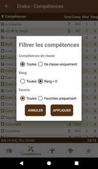
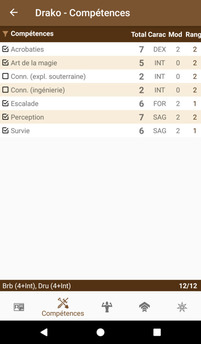
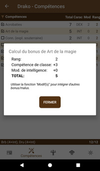
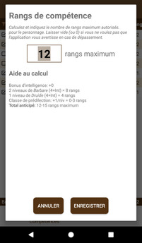

# [Accueil](../README.md) > [Personnages](character.md) > [Gérer](character-details.md) > Compétences

La section _Compétences_ permet la gestion des compétences du personnage.

## Interactions possibles

* Un clic sur la barre d'en-tête du tableau permet d'appliquer des filtres à la liste. Noter que
l'icône de _filtre_ change de couleur lorsque des filtres sont appliqués
* Un clic sur le nom d'une compétence ouvre le [détail de cette compétence](../catalog/skill-details.md)
* Un clic sur une valeur _totale_ ouvre une fenêtre modale présentant le détail du calcul
* Un clic sur une valeur _rang_ permet l'édition/modification du rang
* Un clic sur la barre inférieure permet de spécifier le maximum actuel de rangs du personnage.

_Voir également: [Tutoriel](../tuto/README.md) > [Créer un nouveau personnage](../character/new-character.md)._ 