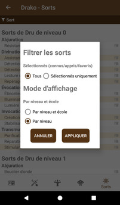
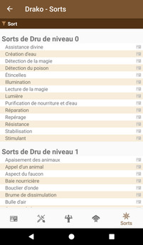
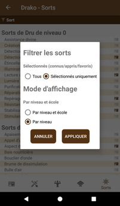
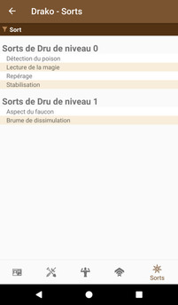

# [Accueil](../README.md) > [Personnages](character.md) > [Gérer](character-details.md) > Sorts

La section _Sorts_ permet la gestion des sorts du personnage.

## Interactions possibles

* Un clic sur la barre d'en-tête du tableau permet d'appliquer des filtres à la liste. Noter que
l'icône de _filtre_ change de couleur lorsque des filtres sont appliqués
* Un clic sur le nom d'un sort ouvre le [détail de ce sort](../catalog/spell-details.md)
* Un clic   
permet d'ajouter/retirer le sort en tant que connus/appris/favori. Cette fonction sert principalement
pour le filtrage et également lors de l'export de la feuille au format PDF.

_Voir également: [Tutoriel](../tuto/README.md) > [Créer un nouveau personnage](../character/new-character.md)._ 