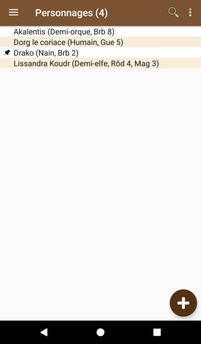
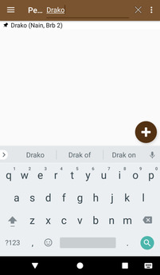

# [Accueil](../README.md) > Personnages

La section _Personnages_ permet de créer et gérer des personnages.

## Créer un nouveau personnage

Au premier lancement, la liste des personnages est vide. Cliquer sur (+) pour [créer un personnage](new-character.md).

## Gestion des personnages

La liste des personnages présente des informations de base pour les distinguer (nom, race, classe, niveau) 
ainsi que indicateur  pour le personnage épinglé. 
* En cliquant sur la loupe, il est possible d'effectuer une recherche dans la liste. 
* Cliquer sur un élément de la liste permet d'accéder à la [gestion du personnage](character-details.md).

 