# [Accueil](..) > [Personnages](character.md) > Créer un nouveau personnage

Cette page décrit typiquement les étapes de création d'un personnage

## Créer un nouveau personnage

Au premier lancement, la liste des personnages est vide. Cliquer sur (+) pour créer un personnage.

<a href="../../images/character/new-character-1.png">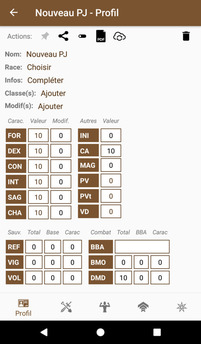</a>

## Choisir le nom, la race et informations supplémentaires

<a href="../../images/character/new-character-2.png">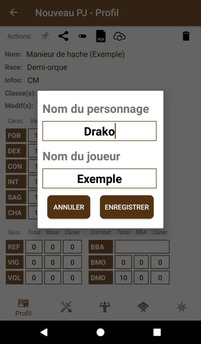</a>
<a href="../../images/character/new-character-3.png">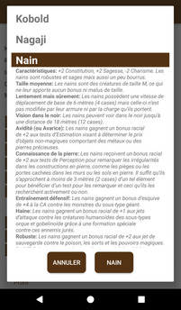</a>
<a href="../../images/character/new-character-4.png">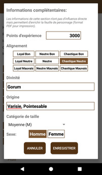</a>
<a href="../../images/character/new-character-5.png">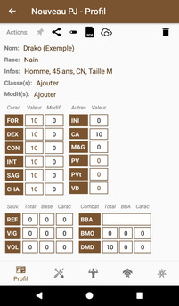</a>

## Choisir la classe et l'archétype

<a href="../../images/character/new-character-7.png">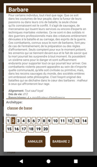</a>
<a href="../../images/character/new-character-8.png">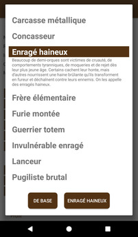</a>
<a href="../../images/character/new-character-9.png">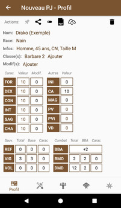</a>

## Choisir les caractéristiques

Choisissez les caractéristiques individuellement ou utilisez la calculatrice.

<a href="../../images/character/new-character-10.png">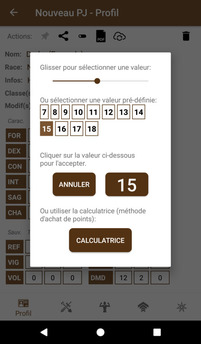</a>
<a href="../../images/character/new-character-11.png">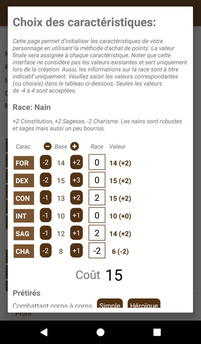</a>

## Spécifier les points de vie et la vitesse

Cliquer sur les cases respectives pour ouvrir les menus d'édition

<a href="../../images/character/new-character-13.png">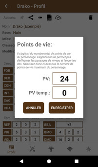</a>
<a href="../../images/character/new-character-14.png">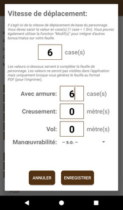</a>
<a href="../../images/character/new-character-15.png">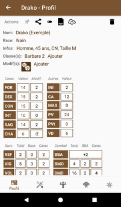</a>

## Choisir les compétences

Ouvrir la page des compétences (navigation inférieure)
* Spécifier le nombre de rangs maximum en cliquant sur la barre brune du fond
* Ajouter des rangs de maîtrise en cliquant sur les chiffres de la colonne "Rang"

<a href="../../images/character/new-character-16.png">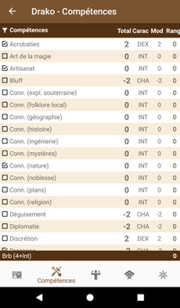</a>
<a href="../../images/character/new-character-17.png">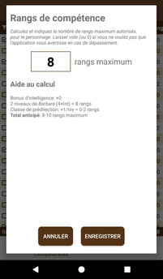</a>
<a href="../../images/character/new-character-18.png">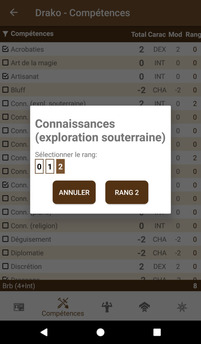</a>
<a href="../../images/character/new-character-19.png">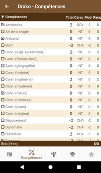</a>

## Choisir les dons

Ouvrir la page des dons (navigation inférieure)
* Cliquer sur le lien _depuis le catalogue_ pour accéder à la liste
* Ajouter des dons grâce à l'action  => 

<a href="../../images/character/new-character-20.png">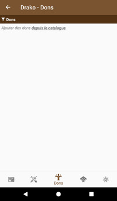</a>
<a href="../../images/character/new-character-21.png">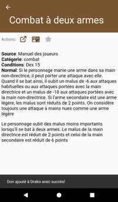</a>
<a href="../../images/character/new-character-22.png">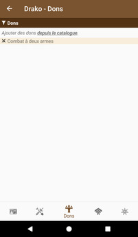</a>

## Choisir les aptitudes

Ouvrir la page des aptitudes (navigation inférieure)
* Les traits de la race naine s'affichent par défaut
* Cliquer sur _base_ (Ajout en lot) pour faire ajouter les aptitudes correspondant à votre classe et niveau
* Cliquer sur le lien _depuis le catalogue_ pour accéder à la liste
* Ajouter des aptitudes spécifiques grâce à l'action  => 
* Les aptitudes peuvent être [liées entre elles](../catalog/feature-details.md)
* Un [texte peut être spécifié](../catalog/feature-details.md) pour une aptitude

<a href="../../images/character/new-character-23.png">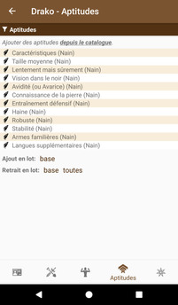</a>
<a href="../../images/character/new-character-24.png">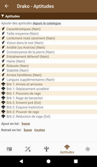</a>
<a href="../../images/character/new-character-25.png">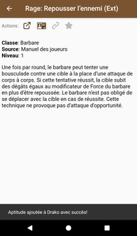</a>
<a href="../../images/character/new-character-26.png">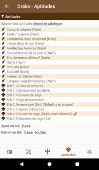</a>

## Ajouter des modifications dynamiques

Retourner sur la page sommaire (navigation inférieure)
* Cliquer sur _Modif(s): ajouter_
* Spécifier un nom et une icône, puis ajouter les bonus/malus correspondants (ex: rage)
* Constatez qu'en cliquant sur l'icône, les bonus/malus s'appliquent sur la feuille

<a href="../../images/character/new-character-27.png">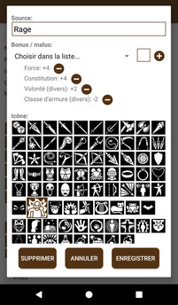</a>

<a href="../../images/character/new-character-29.png">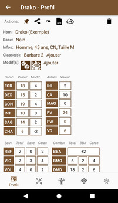</a>

## Finaliser l'équipement

* Cliquer sur une case de richesse (PC, PA, PO, PP) pour indiquer le nombre de pièces dans l'inventaire
* Cliquer sur _Catalogue_ (Inventaire) pour ajouter de l'[équipement](../catalog/equipment.md)
* Noter que le calcul des poids et de la richesse total s'effectue automatiquement

<a href="../../images/character/new-character-31.png">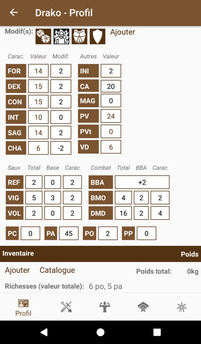</a>
<a href="../../images/character/new-character-32.png">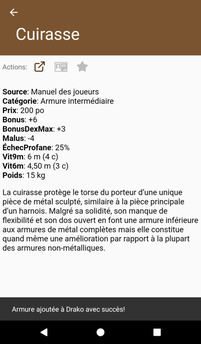</a>
<a href="../../images/character/new-character-33.png">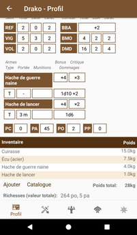</a>

## Création terminée

Votre personnage est désormais créé! Consulter la section [Personnages](character.md) pour découvrir 
plus de subtilités et fonctionnalités de l'application. Amusez-vous bien!