# Character sheet

This page describes how to use the application in order to create and manage character sheets. Since the application is targeting the french community,
the documentation is only available in french.

## Références rapides

* [Catalogue](README.md): gestion des données, catalogue (compétences, dons, sorts) et options
* Ci-dessous: création et gestion d'une feuille de personnage

## Pré-requis

Avant de pouvoir accéder à la section _Personnages_, vous devez ré-importer les données afin d'obtenir les races et classes disponibles.
_NOTES: la liste des races et des classes est partielle (manuel des joueurs uniquement). Des contributeurs participent à compléter les données sur le projet [pathfinderfr-data](https://github.com/SvenWerlen/pathfinderfr-data/tree/master/data)_

## Caractéristiques, race et classe

Pour créer un personnage, il suffit d'accéder à "Personnages" à partir de la navigation. Si le menu n'apparaît pas, c'est que vous n'avez pas importé les données nécessaires (races et classes).
La création du profil de base s'effectue par les étapes suivantes (illustrées dans les captures ci-après):
* Choisir un race
* Choisir une classe (et le niveau acquis dans cette classe). Il est possible de se multiclasser mais la limite de niveaux ne doit pas excéder 20.
* Choisir les valeurs pour les caractéristiques. Cliquer simplement sur l'une des valeurs 10 et la changer telle que souhaitée.

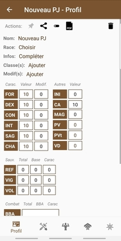
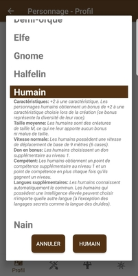
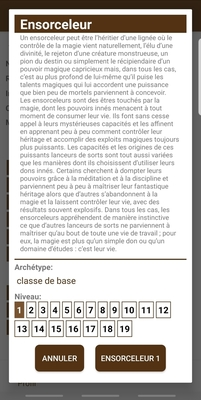
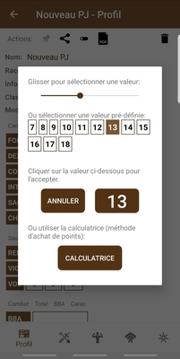

L'affichage a été optimisé pour un téléphone intelligent en utilisant le moins d'espace possible. Par conséquent, les attributs sont toujours présentés sous une forme abrégée (ex: **CA** pour **C**lasse d'**A**rmure). Cependant, des infobulles ont été ajoutées pour vous aider.
* En cliquant sur une abbréviation, une infobulle apparaît pour indiquer sa signification complète
* En cliquant sur un total, une infobulle apparaît pour vous expliquer le détail du calcul

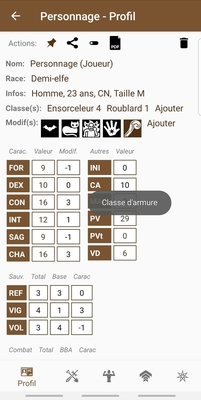
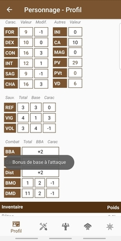
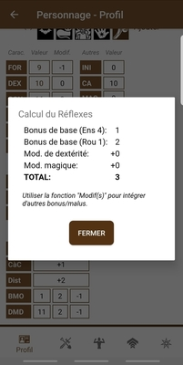

## Compétences

La gestion des compétences s'effectue à partir du deuxième onglet (au bas de l'écran).
* En cliquant sur barre d'en-tête (ou se trouve la mini icône _filtre_), une fenêtre vous permet de configurer les filtres de compétences 
  * **Compétences de classes**: permet d'afficher uniquement les compétences de classes
  * **Rang**: permet d'afficher uniquement les compétences pour lesquelles le personnage dispose d'un rang d'au moins 1
  * **Favoris**: permet d'afficher uniquement les compétences que vous avez séléctionné comme favorites
* En cliquant sur l'une des valeurs de la colonne _Rang_ (dernière colonne), vous pouvez sélectionner le rang que le personnage dispose dans cette compétence
* En cliquant sur l'une des valeurs de la colonne _Total_, vous obtiendrez une infobulle avec le détail du calcul
   
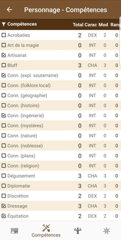
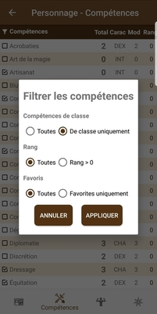
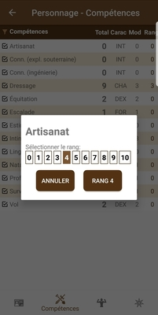
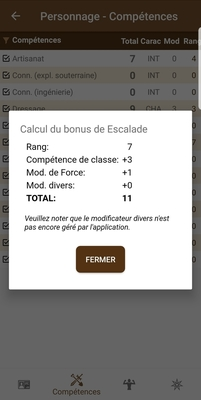

## Dons

La gestion des dons s'effectue à partir du troisième onglet (au bas de l'écran).
* L'ajout d'un don s'effectue un peu différemment que pour les compétences en raison de leur nombre très élevé. À partir du catalogue des dons, il est possible de trouver le don à ajouter. Pour l'ajouter, il suffira alors de cliquer sur l'icône d'action correspondante (2ième mini-icône ressemblant à une carte d'identité)
* En cliquant sur barre d'en-tête (ou se trouve la mini icône _filtre_), une fenêtre vous permet de configurer les filtres de dons 
  * **Type**: permet d'afficher uniquement les dons de combat ou tous les dons sauf ceux de combat
  * **Favoris**: permet d'afficher uniquement les dons que vous avez séléctionné comme favoris

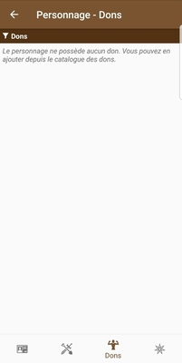

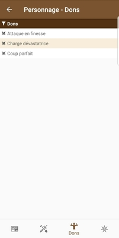
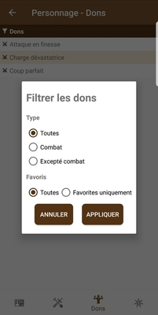

## Aptitudes

La gestion des aptitudes s'effectue à partir du quatrième onglet (au bas de l'écran).
* L'ajout d'une aptitude s'effectue comme pour les dons. À partir du catalogue des aptitudes dans la bibliothèque, il est possible de trouver une aptitude à ajouter. Pour l'ajouter, il suffira alors de cliquer sur l'icône d'action correspondante (2ième mini-icône ressemblant à une carte d'identité)
* Les aptitudes de classe automatique sont affichées en fonction de votre/vos classe(s) sans que vous ayiez besoin de les ajouter 
* En cliquant sur barre d'en-tête (ou se trouve la mini icône _filtre_), une fenêtre vous permet de configurer les filtres de dons 
  * **Favoris**: permet d'afficher uniquement les dons que vous avez séléctionné comme favoris

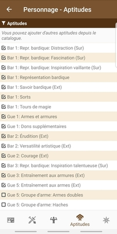
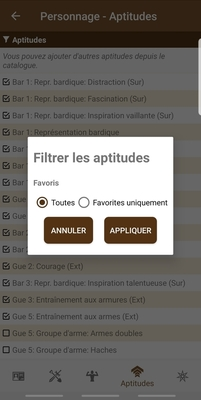

## Sorts

L'ajout de sorts s'effectue à partir du cinquième onglet (au bas de l'écran).
* En cliquant sur barre d'en-tête (ou se trouve la mini icône _filtre_), une fenêtre vous permet de configurer les filtres de sorts mais également adapter l'affichage
  * **Favoris**: permet d'afficher uniquement les dons que vous avez séléctionné comme favoris
  * **Affichage**: permet de choisir l'affichage par niveau et école (pratique pour les magiciens et ensorceleurs) ou uniquement par niveau (généralement pour les autres classes)
* Pour faciliter l'ajout d'un sort aux favoris (peut être utilisé pour sélectionner les sorts pour la journée), il suffit de cliquer sur les icônes correspondantes (_étoile_) présentes à droite de chaque sort

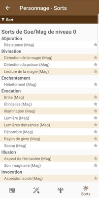
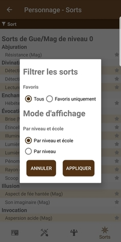
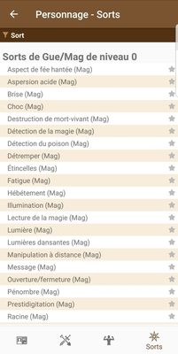
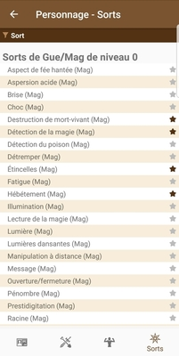

