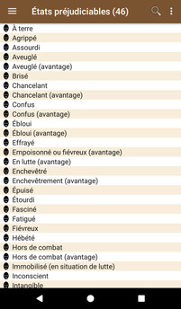
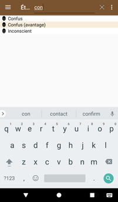

# [Accueil](../README.md) > [Pour le MJ](../navigation/README.md) > États préjudiciables

La liste des états préjudiciables de Pathfinder.

Cliquer sur un élément de la liste permet d'accéder à la [page de détail de l'état préjudiciable](condition-details.md).

## Recherche

En cliquant sur la loupe, il est possible d'effectuer une recherche dans la liste 

