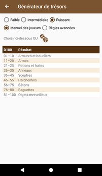
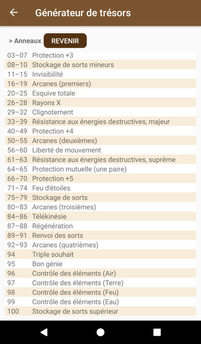
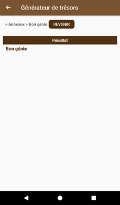
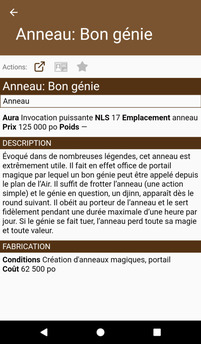
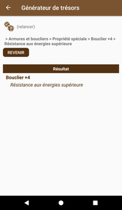
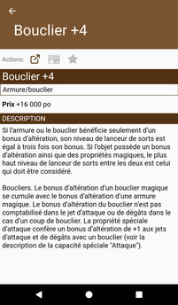

# [Accueil](../README.md) > [Pour le MJ](../navigation/README.md) > Générateur de trésors

Le générateur de trésors, comme son nom l'indique, permet à un maître de jeu de rapidement générer
un trésor (suite à un combat aléatoire par exemple). Le générateur de trésor se base sur la
[détermination aléatoire d'objets magiques](https://www.pathfinder-fr.org/Wiki/Pathfinder-RPG.D%c3%a9termination%20al%c3%a9atoire%20dobjets%20magiques.ashx).

* **Faible | Intermédiaire | Puissant**: choisissez la puissance de l'objet magique à générer. Cette
option est inutile si vous naviguer manuellement (plutôt qu'aléatoirement)
* **Manuel des joueurs | Règles avancées**: les règles avancées proposent certaines tables alternatives.

## Navigation manuelle

Si vous désirez lancer les dés manuellement ou simplement choisir chaque étape, vous pouvez 
naviguer d'une table à l'autre jusqu'au résultat final. Cliquer sur le résultat amène à la [page
de détails de l'objet magique](../catalog/magic-details.md).

 

## Génération aléatoire

Pour générer aléatoire un objet, il suffit d'effectuer les configurations souhaitées et cliquer
sur le bouton .

