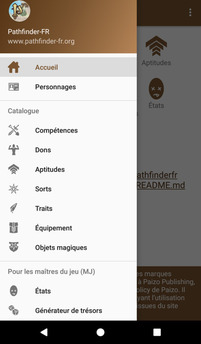

# [Accueil](..) > Navigation

La navigation latérale permet d'accéder rapidement à chaque section de l'application

* **[Accueil](..)**: retourner à l'écran d'accueil
* **[Personnages](../character/character.md)**: gérer un ou plusieurs personnages (PJ)

**Catalogue**

Toutes les rubriques du catalogue permettent de lister et retrouver les détails d'un élément.

* **[Compétences](../catalog/skills.md)** 
* **[Dons](../catalog/feats.md)**
* **[Aptitudes](../catalog/features.md)** 
* **[Sorts](../catalog/spells.md)**
* **[Traits](../catalog/traits.md)**
* **[Équipement](../catalog/equipment.md)**
* **[Objets magiques](../catalog/magic.md)**

**Pour les maîtres du jeu (MJ)**

* **[États](../gm/conditions.md)**: les états préjudiciables
* **[Générateur de trésors](../gm/generator.md)**: un générateur de trésors
* **[Mettre à jour la bibliothèque](../gm/loaddata.md)**: pour vérifier et mettre à jour les données de l'application