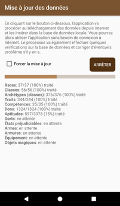
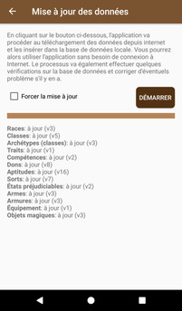

# [Accueil](../README.md) > [Options avancées](../navigation/README.md) > Mise à jour des données

Cette section permet de mettre à jour les données de l'application.  

* Il est possible d'arrêter une mise à jour en cours mais cela met votre base de données dans un état
incomplet. Il vous faudra alors relancer la mise à jour plus tard avec  _Forcer la mise à jour_
* Durant le processus, il n'est pas possible de retourner à l'écran d'accueil ou accéder à la navigation

>  si vous expérimentez des comportements étranges, essayez de mettre
à jour les données avec l'option  _Forcer la mise à jour_.

## Les étapes de la mise à jour
* L'application effectue quelques tests pour valider la structure de la base de données 
* L'application récupère le manifest sur https://github.com/SvenWerlen/pathfinderfr-data
* Si vous disposez déjà des dernières versions de chaque liste, la mise à jour s'arrête sauf avec  _Forcer la mise à jour_
* L'application récupère chacune des listes et importe les données dans la base de donnée locale
* L'application indexe les sorts afin que les recherches / filtres sur les sorts soient plus rapides

Capture: _lorsqu'aucune mise à jour n'est nécessaire_

