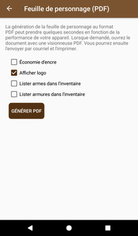
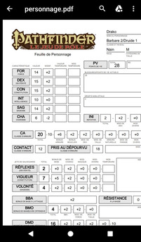
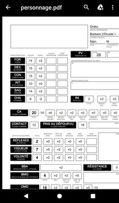
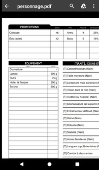
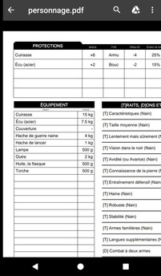

# [Accueil](../README.md) > [Tutoriels](README.md) > Feuille de personnage (PDF)

Ce [tutoriel](../tuto/README.md) décrit les étapes pour générer une feuille de personnage au format PDF.

## Générer et imprimer une feuille de personnage

Pour générer une feuille de personnage au format PDF:
* À partir de la [section _Profil_ du personnage](../character/character-main.md), cliquer sur l'action .
* Choisissez les options souhaitées et cliquer sur le bouton `Générer PDF`
* Ouvrir le résultat avec une application capable d'afficher des fichiers au format PDF

Télécharger le [PDF de l'exemple ci-dessus](personnage.pdf).

## Options Économie et Logo

* L'option _Économie d'encre_ réduit le contrast de la feuille en utilisant du gris plutôt que du noir.
Cette option permet de réduire la consommation en encre lors d'impression
* L'option _Afficher logo_, lorsque désactivée, remplace le logo habituel par une zone permettant 
la saisie de notes ou un dessin de profil

## Options Lister armes/armures dans inventaire

Les options _Lister armes dans l'inventaire_ et _Lister armures dans l'inventaire_ offrent la possibilité
de rendre visibles les armes et armures dans l'inventaire, malgré le fait que celles-ci aient leur
propre section dans la feuille de personnage. Certains joueurs apprécient voir tous les éléments
de leur équipement listés dans la section inventaire.

