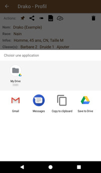
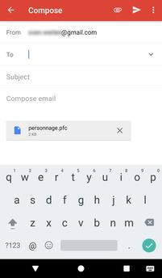
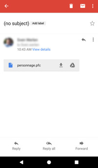
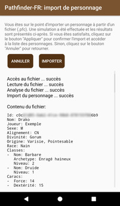

# [Accueil](../README.md) > [Personnages](character.md) > Export/Importer un personnage

Ce [tutoriel](../tuto/README.md) décrit les étapes pour exporter et importer un personnage

## Exporter un personnage

Pour exporter un personnage, il suffit de cliquer sur l'action .
Android propose alors une série d'options qui dépend des applications qui sont installées sur votre
appareil et permettent le partage d'un fichier texte. Les captures ci-dessous illustrent l'export
et le partage par courriel avec Gmail. 

<a href="../../images/tuto/share.png"></a>
<a href="../../images/tuto/share-byemail.png"></a>

Si vous tentez d'ouvrir le fichier et de l'éditer, vous constaterez qu'il s'agit d'un fichier texte
au format [YAML](https://fr.wikipedia.org/wiki/YAML) facilement lisible.

```yaml
Id: c0cXXXXX-XXXX-XXXX-XXXX-XXXXXXXXX6b9
Nom: Drako
Joueur: Exemple
Sexe: M
Alignement: CN
Divinité: Gorum
Origine: Varisie, Pointesable
Race: Nain
Classes: 
-  Nom: Barbare
   Archetype: Enragé haineux
   Niveau: 2
-  Nom: Druide
   Niveau: 1
Caracs: 
-  Force: 14
-  Dextérité: 15
-  Constitution: 13
-  Intelligence: 10
-  Sagesse: 12
...
```
_(télécharger [personnage-drako.pfc](personnage-drako.pfc))_


>  Ce format permet techniquement de créer des personnages à partir d'autres applications / scripts
pour autant que la structure soit respectée.

## Importer un personnage

Pour importer un personnage, il faut ouvrir le fichier `personnage.pfc` sur un appareil disposant
de l'application PathfinderFR-Android. 
* Récupérer le fichier
* Ouvrir le fichier (choisir Pathfinder FR si le système vous demande avec quelle application ouvrir)
* Sur l'écran de validation, vérifier la présence d'avertissements ou d'erreurs
* Cliquer sur _Importer_ pour importer le personnage chargé à partir du fichier

<a href="../../images/tuto/import1.png"></a>
<a href="../../images/tuto/import2.png"></a>

Si vous éprouvez de la difficulté à l'import:
* Assurez-vous que votre application est à jour
* Assurez-vous d'avoir [mis les données à jour](../options/loaddata.md). Forcer la mise à jour_au besoin.
* Si les problèmes persistent, partager les problèmes sur le [Discord de l'application](https://discord.gg/Dhg3HW9)